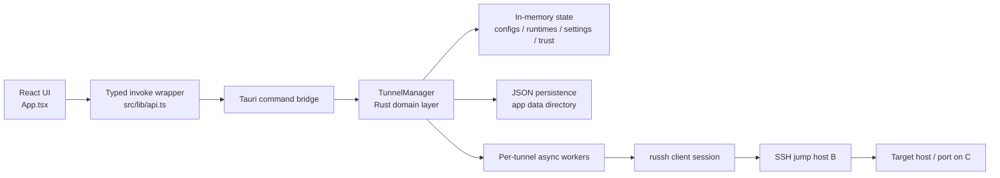

# NexPort Architecture

## 1. Document Purpose

This document describes the production architecture of **NexPort**, a native desktop application for managing SSH port forwarding rules.

It is intended for:

- engineers maintaining the codebase
- reviewers evaluating runtime behavior and operational risk
- contributors extending the frontend, backend, packaging, or release workflow

This document reflects the current implementation in:

- [src/App.tsx](C:/Users/Administrator/Documents/temp/code/aizeek/port-forward/src/App.tsx)
- [src/lib/api.ts](C:/Users/Administrator/Documents/temp/code/aizeek/port-forward/src/lib/api.ts)
- [src/types.ts](C:/Users/Administrator/Documents/temp/code/aizeek/port-forward/src/types.ts)
- [src-tauri/src/lib.rs](C:/Users/Administrator/Documents/temp/code/aizeek/port-forward/src-tauri/src/lib.rs)
- [src-tauri/src/tunnel.rs](C:/Users/Administrator/Documents/temp/code/aizeek/port-forward/src-tauri/src/tunnel.rs)
- [src-tauri/tauri.conf.json](C:/Users/Administrator/Documents/temp/code/aizeek/port-forward/src-tauri/tauri.conf.json)

## 2. System Goals

NexPort is designed around four primary goals:

1. Provide a native desktop control plane for SSH forwarding rules.
2. Support multiple concurrent tunnel rules without blocking the UI command path.
3. Make risky SSH workflows explicit through visible host-key trust and test feedback.
4. Keep the implementation operationally simple: local-first, file-backed, single-process, no server dependency.

## 3. System Scope

NexPort currently manages **local port forwarding through SSH jump hosts**.

The canonical topology is:

```text
Client A -> SSH to B -> TCP target on C
```

Where:

- A is the operator desktop running NexPort
- B is the SSH-accessible jump host
- C is the final TCP target reachable from B

The application supports forwarding arbitrary TCP services, including:

- SSH
- databases
- Redis
- internal HTTP services
- custom TCP protocols

## 4. Architectural Style

NexPort follows a **single-binary desktop application** architecture:

- **Presentation layer**: React + Tailwind UI rendered in a Tauri webview
- **Application boundary**: Tauri command bridge
- **Domain/runtime layer**: Rust tunnel manager, state management, SSH session lifecycle
- **Persistence layer**: local JSON files in the application data directory
- **Distribution layer**: GitHub Actions based multi-platform packaging

There is no remote control plane, database, or daemon dependency.

## 5. High-Level Architecture



## 6. Frontend Architecture

### 6.1 Entry and Composition

The frontend entry is [src/main.tsx](C:/Users/Administrator/Documents/temp/code/aizeek/port-forward/src/main.tsx), which mounts a single top-level application component.

The application surface is concentrated in [src/App.tsx](C:/Users/Administrator/Documents/temp/code/aizeek/port-forward/src/App.tsx). This file currently contains:

- top menu bar and custom title bar
- rules table and toolbar actions
- tunnel create/edit modal
- details modal
- settings modal
- help modal
- testing and trust acceptance flows

This is acceptable for the current product stage, but it also means the frontend is still **composition-heavy in one module**. Future extraction into feature modules should preserve the current typed API contract.

### 6.2 Frontend-to-Backend Contract

The invoke boundary is intentionally thin and typed:

- [src/lib/api.ts](C:/Users/Administrator/Documents/temp/code/aizeek/port-forward/src/lib/api.ts)
- [src/types.ts](C:/Users/Administrator/Documents/temp/code/aizeek/port-forward/src/types.ts)

The frontend does not implement SSH logic, port inspection, or persistence rules. It acts as:

- input collection
- state rendering
- action dispatch
- modal and feedback orchestration

This keeps operational behavior centralized in Rust, which is the correct boundary for production tunnel behavior.

## 7. Backend Architecture

### 7.1 Process Model

The Rust side runs inside the Tauri application process. There is no external background service.

Initialization occurs in [src-tauri/src/lib.rs](C:/Users/Administrator/Documents/temp/code/aizeek/port-forward/src-tauri/src/lib.rs):

- bootstrap persistent state
- register Tauri commands
- register tray integration
- set runtime icons
- optionally auto-start persisted tunnel rules

### 7.2 Command Layer

The Tauri command surface is intentionally explicit:

- `bootstrap`
- `save_tunnel`
- `delete_tunnel`
- `start_tunnel`
- `stop_tunnel`
- `start_all`
- `stop_all`
- `update_settings`
- `clear_logs`
- `test_tunnel`
- `trust_host_key`
- `remove_trusted_host`
- `export_rules`
- `import_rules`

These commands form the only supported control API from UI to backend.

### 7.3 Domain Core: `TunnelManager`

The central domain object is `TunnelManager` in [src-tauri/src/tunnel.rs](C:/Users/Administrator/Documents/temp/code/aizeek/port-forward/src-tauri/src/tunnel.rs).

It owns:

- persistent configuration metadata
- application settings
- trusted host fingerprints
- runtime handles for active tunnels
- bounded log buffer
- runtime status map

The current structure separates:

- **manager-owned mutable business state** behind a short-lived `std::sync::Mutex`
- **runtime tunnel status** behind a dedicated shared map
- **logs** behind a dedicated shared queue

This is a meaningful improvement over a single async mutex wrapped around the entire manager because it reduces cross-command head-of-line blocking.

## 8. Runtime Concurrency Model

### 8.1 Design Principle

The system is designed so that:

- UI commands should not be blocked by long-running network sessions
- one tunnel should not serialize all other tunnels
- one accepted local connection should not block later accepts for the same tunnel

### 8.2 Tunnel Worker Model

Each started rule spawns a **per-tunnel background worker** via `tauri::async_runtime::spawn`.

That worker:

1. binds the configured local listening port
2. establishes one authenticated SSH session to the jump host
3. marks the tunnel as `running`
4. accepts incoming local TCP connections
5. spawns one async task per accepted connection

The key design choice is:

- **one SSH transport per tunnel**
- **many `direct-tcpip` channels per tunnel session**
- **one connection task per accepted socket**

This model supports multiple simultaneous connections on the same forwarding rule without serializing the accept loop.

### 8.3 Shutdown Model

Each tunnel runtime owns a `watch::Sender<bool>` shutdown channel.

The worker listens for shutdown signals and exits its accept loop when signaled. The manager then awaits the worker join handle during stop.

This creates a predictable stop sequence:

1. mark `stopping`
2. signal shutdown
3. await worker completion
4. reset status to default

## 9. State Model

The system maintains three important state classes:

### 9.1 Persistent Business State

Stored in `ManagerState`:

- tunnel rules
- settings
- trusted hosts
- runtime handle registry

### 9.2 Volatile Runtime Status

Stored separately as `runtime_status`:

- current tunnel lifecycle state
- status message
- active connection count
- last error
- start timestamp

This separation is important because runtime status changes more frequently than persisted configuration.

### 9.3 Operational Logs

Stored as a bounded `VecDeque<LogEntry>` with `LOG_LIMIT`.

This prevents unbounded in-memory growth while still giving the operator a recent troubleshooting window.

## 10. Persistence Model

NexPort uses local JSON persistence in the application data directory.

Current files:

- `tunnels.json`
- `settings.json`
- `known_hosts.json`

### 10.1 Why JSON Is Appropriate Here

JSON is a reasonable persistence strategy for this product tier because:

- state volume is small
- local inspectability is useful
- export/import is a first-class workflow
- no relational querying is required

### 10.2 Persistence Characteristics

The current model is:

- full-file rewrite on mutation
- no incremental journaling
- no schema migration engine yet

This is acceptable for a desktop tool with small state, but future hardening may add:

- explicit versioned migration routines
- temp-file + atomic rename persistence
- optional encrypted secret storage for credentials

## 11. Security Model

### 11.1 Host Key Verification

Host key verification is a core safety feature, not a UI afterthought.

The backend records trusted host fingerprints and compares observed SSH server keys during connection setup.

Possible states:

- `skipped`
- `trusted`
- `unknown`
- `mismatch`

The UI can then require explicit trust acceptance when needed.

### 11.2 Authentication Methods

Supported authentication:

- password
- private key

Private key loading is handled in Rust. Paths may be expanded from `~/...`.

### 11.3 Current Security Limitation

Sensitive values such as passwords and key passphrases are currently part of local configuration data structures.

That means the architecture is operationally functional, but not yet ideal for high-assurance secret storage. A production-hardening path should consider:

- OS keychain integration
- DPAPI / Keychain / libsecret backed credential storage
- separating secret persistence from rule metadata

## 12. Validation and Testing Flow

Before starting a tunnel, the backend performs preflight validation:

- local bind availability
- host key state
- SSH reachability
- authentication success
- target reachability

This behavior is exposed separately through `test_tunnel`, allowing the UI to surface actionable status before a rule is started.

This is a strong product decision because it reduces “start and hope” behavior and makes failure states explicit.

## 13. Observability

Observability is currently local and operator-facing.

Signals provided:

- per-rule status
- last error
- active connection count
- structured log entries
- test output for trust, port, auth, and target checks

This is sufficient for a desktop operator tool. If NexPort ever becomes centrally managed, the next step would be structured export of logs and diagnostics rather than only in-app viewing.

## 14. Desktop Integration

Desktop-specific behavior is managed in [src-tauri/src/lib.rs](C:/Users/Administrator/Documents/temp/code/aizeek/port-forward/src-tauri/src/lib.rs).

Current integration points:

- custom window icon
- tray icon and tray menu
- close-to-tray behavior
- launch-on-startup plugin wiring

The application intentionally behaves like a long-lived desktop utility rather than a disposable web shell.

## 15. Release and Packaging Architecture

The release workflow is defined in:

- [.github/workflows/release.yml](C:/Users/Administrator/Documents/temp/code/aizeek/port-forward/.github/workflows/release.yml)

The release pipeline currently:

- runs on GitHub Actions
- builds Windows, Linux, and macOS packages
- uses the Tauri action for packaging and publishing
- publishes tagged releases

This keeps release generation close to the application’s native toolchain rather than inventing a custom packaging layer.

## 16. Failure Modes and Operational Risks

The most relevant current operational risks are:

### 16.1 Secret Persistence

Credentials are not yet isolated into OS-native secure storage.

### 16.2 Single-File Frontend Composition

The main React surface is large and concentrated in one file, increasing local complexity and regression risk when UI behavior expands.

### 16.3 File Persistence Durability

Current JSON rewrite persistence is simple, but not yet optimized for crash-consistent atomic writes.

### 16.4 Local-Only Observability

There is no export-grade telemetry pipeline, only local logs and local UI diagnostics.

### 16.5 Some User-Facing Strings Need Cleanup

Parts of the Rust backend still contain mojibake or partially repaired strings. This is not an architectural defect, but it does affect operational quality and user trust.

## 17. Recommended Next Architecture Steps

Priority-ordered next steps:

1. Move secrets into OS-native credential storage.
2. Introduce atomic persistence writes with temporary files and rename semantics.
3. Split frontend features into modules:
   - shell / title bar
   - rule list
   - rule editor
   - settings
   - diagnostics
4. Normalize and repair all backend user-facing messages.
5. Add integration tests around:
   - tunnel start/stop lifecycle
   - concurrent connection handling
   - import/export behavior
   - host key trust transitions

## 18. Summary

NexPort already has a solid production direction:

- native desktop shell
- Rust-managed tunnel lifecycle
- explicit trust model
- short-lock manager architecture
- per-tunnel workers
- per-connection concurrency

Its strongest architectural trait is that it keeps the hard parts in the backend:

- connection lifecycle
- trust verification
- status transitions
- concurrency control
- persistence

That is the right foundation for a desktop SSH operations tool. The next maturation step is not a rewrite. It is systematic hardening: secrets, persistence durability, modular frontend decomposition, and broader automated verification.
